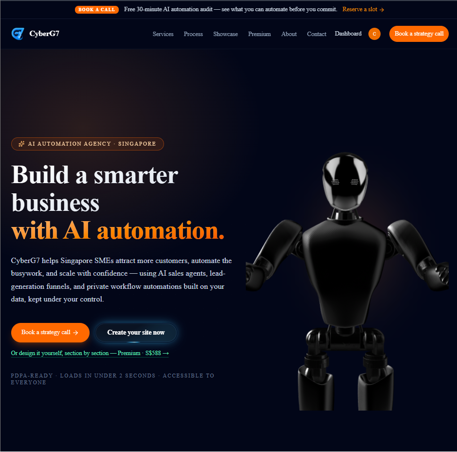
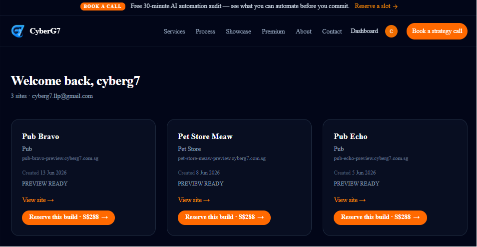
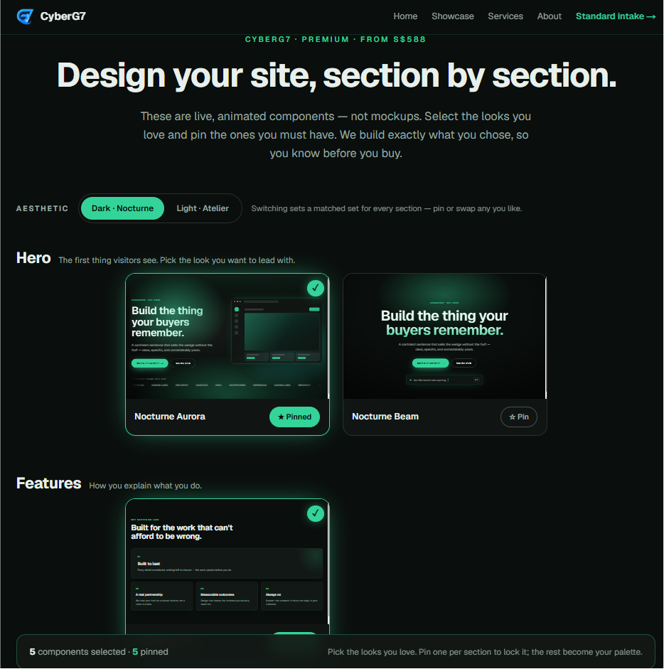
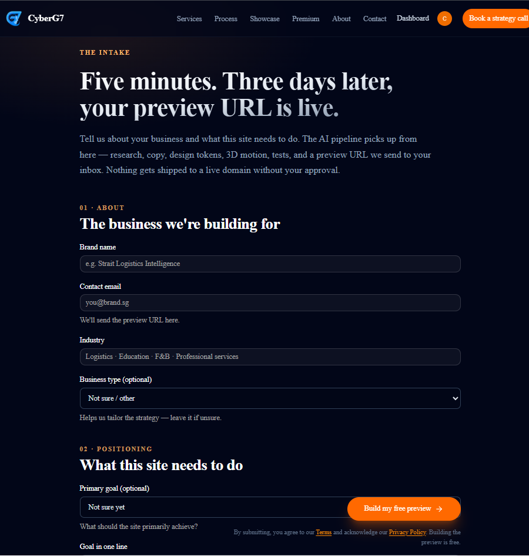

# 🏭 Website Factory — Autonomous Per-Brand Site Renderer

**🔗 Live site:** https://agency.cyberg7.com.sg

> **A Next.js 16 runtime + orchestrator that turns a one-page brief into a premium, per-brand
> marketing site served on demand** — one component library renders *N* brand looks, with
> **no per-client code**. Production at **[agency.cyberg7.com.sg](https://agency.cyberg7.com.sg)**;
> every brand preview lives at `<slug>-preview.cyberg7.com.sg`.


---

## TL;DR

**The problem.** A boutique web agency that hand-codes a bespoke site per client doesn't scale —
every new brand is a fresh repo, a fresh deploy, and fresh maintenance. But a single templated
theme reused across clients looks like exactly that: a template.

**The solution.** Drive everything from data. A prospect fills an intake form; an orchestrator
pipeline researches the brand, derives a strategy brief, picks section variants with a semantic
selector, sources and re-hosts assets, then **renders the page server-side on every request** from
an Airtable row. One component library produces a brand-correct site per slug — verified across
**11 live brand previews** — and content changes go live with **no rebuild or redeploy**.

**Why it's interesting engineering.** The renderer is a **slot-registry dispatcher** fed by a
**catalog-driven semantic selector**: adding a new design variant is a data operation (register the
component, add an embedded catalog row) with **zero selector code changes**. A premium "Nocturne"
motion tier is reachable **by data alone** — flip the palette and component choices, no per-brand code.

---

## What it does

| Capability | How it works |
|---|---|
| **Per-brand preview renderer** | `src/app/preview/[slug]` is server-rendered on each request from an Airtable row, choosing hero / features / cta / faq / testimonial variants via the catalog-driven selector. One library → N looks. |
| **Orchestrator pipeline** | Secret-gated `POST` routes under `src/app/api/orchestrator/*` advance a job: research → (enrich-research) → design → generate-assets → build → test → deploy → finalize, with `snapshot` + `resume` for durability. |
| **Catalog-driven selection** | Brand fingerprint (industry + audience + goal + strategy) is embedded with OpenAI `text-embedding-3-small`; each slot's live variants are scored by cosine similarity + industry-tag overlap + recent-job diversity. |
| **Premium "Nocturne" tier** | Opt-in dark + single-neon + aurora/glass/magnetic-CTA motion tier for tech/AI/SaaS brands — reachable by data only (palette + component choices), no per-brand code. |
| **Multi-page brand sites** | Host-based routing serves `/`, `/about`, `/services`, `/case-studies`, `/contact` off each `<slug>-preview` subdomain. |
| **Intake + reservation funnel** | `/intake` (standard) and `/premium-intake` (S$588 tier) with a Stripe "Reserve this build" deposit, a status timeline, and prospect/operator email. |
| **Public showcase** | A homepage auto-scroll carousel plus a dedicated `/showcase` page of factory-generated brands. |

---

## Architecture — the orchestrator pipeline

Each stage is a secret-gated route that reads/writes one Airtable job record; the renderer consumes
that record live on every request.

```
 Intake ─► Research ─► Design ─► Assets ─► Build ─► Test ─► Deploy ─► Finalize
 (/intake,  (Firecrawl   (brand-      (Pixabay→   (page   (render   (Vercel    (prospect +
  Stripe     branding +   curation +   Vercel      assembly sanity   subdomain   operator
  deposit)   strategy     semantic     Blob        checks)  + SEO +   register)   email)
             brief)       selector →   re-host)            QA gate)
                          componentChoices)
                                │
                                ▼
            Renderer:  <slug>-preview.cyberg7.com.sg  ──►  /preview/[slug]
            (reads Airtable every request → slot registry dispatches variants;
             content changes go live with NO build/deploy)

  Durability:  POST /snapshot  → per-job artifact manifest in Vercel Blob
               POST /resume    → which artifacts exist + last/next stage
```

### Slot registry pattern

Every section is a slot dispatcher: the page reads `componentChoices.<slot>` from Airtable and calls
`render<Slot>()`. The renderer falls back to the first variant if the name is missing or unknown.

| Slot | File | Dispatcher |
|---|---|---|
| hero | `src/components/preview/heroes.tsx` | `renderHero()` |
| features | `src/components/preview/features.tsx` | `renderFeatures()` |
| cta | `src/components/preview/ctas.tsx` | `renderCta()` |
| faq | `src/components/preview/faqs.tsx` | `renderFaq()` |
| testimonial | `src/components/preview/testimonials.tsx` | `renderTestimonial()` |

Each registry follows the same shape — a `const` variant map, a `keyof` variant-name type, a type
guard, and a `renderSlot(name, props)` dispatcher — so adding a variant never touches the selector.

### Per-brand theming

All slot variants read CSS custom properties on the page root (`--primary-*`, `--accent-*`,
`--surface-*`, `--text-*`, `--eyebrow-fg`). **One component = N brand looks**, verified across 11
live previews with palette-shifted hero / features / cta / faq sections. A dark-theme footer guard
(`preview-context.footerFg`) keeps text legible on Nocturne palettes.

---

## Tech stack

- **Next.js 16.2** (App Router, RSC) · **React 19** · **TypeScript** (strict) · **Tailwind 4**
- **UI:** Radix UI + `@base-ui/react` + shadcn + `class-variance-authority` · `lucide-react` · `embla-carousel`
- **Motion / 3D:** `framer-motion` · `gsap` · `three` + `@splinetool/react-spline`
- **Clerk** — attaches auth context to marketing pages (routes stay public; `auth.protect()` is never called)
- **Stripe** — reservation deposits (Checkout, live mode) · **Zod 4** — intake/schema validation · **react-hook-form**
- **Data & services (via REST, not SDKs):** **Airtable** (job store + `components_catalog`) · **Vercel Blob** (`@vercel/blob`, asset hosting) · **Firecrawl** (brand research) · **OpenAI** `text-embedding-3-small` (selector) · **n8n** (orchestration)
- **Testing:** Vitest 4 (+ Testing Library, jsdom) · Playwright (+ `@axe-core/playwright` for a11y/visual)
- **Deploy:** Vercel · **Secrets:** Doppler (`cyberg7-infra/prd`) + Vercel project env

---

## Project structure

```
website-factory/                          # repo root (package name: cyberg7-agency)
├── CLAUDE.md                             # ⭐ architecture spec (slot registry, selector, regen workflow)
├── AGENTS.md                             # Next.js 16 agent guardrail
├── IMPLEMENTATION_STATUS.md              # handoff → live-repo milestone map (M50–M58 shipped)
├── CyberG7_…_Website_Engine_Handoff.md   # the conceptual handoff this repo adapts
├── research.md                           # research notes
├── context/agent-operating-model.md      # handoff↔repo agent map + orchestrator endpoints
├── docs/{plans,specs}/                   # planning + specs
├── components.json                       # shadcn config
├── src/
│   ├── proxy.ts                          # ⭐ host routing for *-preview subdomains (Next 16 `proxy`, ex-middleware)
│   ├── app/
│   │   ├── preview/[slug]/               # ⭐ the per-request renderer (+ /about, /services, …)
│   │   ├── api/orchestrator/             #   stage routes: research · design · generate-assets ·
│   │   │                                 #   build · test · deploy · finalize · snapshot · resume
│   │   ├── api/{checkout,stripe,intake,premium-intake,status,upload-logo}/
│   │   ├── intake/ · premium-intake/     #   standard + S$588 intake funnels
│   │   ├── showcase/ · status/ · dashboard/ · about/ · terms/ · privacy/
│   │   └── layout.tsx · page.tsx · opengraph-image.tsx · robots.ts
│   ├── components/
│   │   ├── preview/                      #   slot registries (heroes/features/ctas/faqs/testimonials) + premium/
│   │   ├── sections/ · blocks/ · ui/ · premium-intake/
│   ├── lib/
│   │   ├── orchestrator-stages/          #   component-selector.ts (M33) · assets.ts (M31) · …
│   │   ├── strategy/                      #   industry adapters + deriveStrategyBrief + Zod brief schema
│   │   ├── artifacts/ · inspiration/ · qa/ · stitch/ · motion/
│   │   ├── airtable.ts · embedding.ts · firecrawl.ts · stripe.ts · json-ld.ts · …
│   └── …
├── scripts/                              # embed-catalog · seed-slot-defaults · catalog-stats · per-brand shots · *-verify
├── e2e/ · tests/                         # Playwright (a11y/visual) · Vitest suites
└── next.config.ts · playwright.config.ts · vitest.config.ts · tsconfig.json
```

---

## Getting started

```bash
npm install
cp .mcp.json.example .mcp.json     # optional: Mobbin / Stitch / 21st MCPs (dev/worker-time only)

npm run dev                        # local dev server (http://localhost:3000)
```

With Airtable env unset, the app runs in a **demo mode** (no persistence).

**Quality gates** (from `package.json`)

```bash
npm run lint                       # eslint (next config)
npm run test:run                   # Vitest once (CI / gate)
npm run build                      # production Next.js build (includes app TypeScript)
npm run verify                     # test:run + build  (run before a preview)
npm run test:e2e                   # Playwright a11y + visual (hits PROD via PW_BASE_URL)
```

**Environment** — secrets live in Doppler (`cyberg7-infra/prd`) and the Vercel project env. Key vars:
`AIRTABLE_BASE_ID` / `AIRTABLE_PAT`, `ORCHESTRATOR_SECRET`, `STRIPE_SECRET_KEY` / `STRIPE_WEBHOOK_SECRET`,
`BLOB_READ_WRITE_TOKEN`, `FIRECRAWL_API_KEY`, `OPENAI_API_KEY`, `VERCEL_TOKEN` / `VERCEL_PROJECT_ID`.

### Adding a new variant (the whole workflow)

1. Implement the React fn `(props: SlotProps) => ReactNode` in the slot file and register it in `SLOT_VARIANTS`.
2. Add an `internal:<VariantName>` row to the Airtable `components_catalog` (rich `description`, `industryFit`, `moodTags`).
3. Run `node scripts/embed-catalog.mjs` (via Doppler) to embed the new row.
4. Test + build + deploy. **No selector code changes** — the catalog drives selection at runtime.

---

## Engineering highlights

- **Data-driven renderer, zero per-client code** — every brand site is one Airtable row dispatched through a shared slot registry; the renderer reads on every request, so content/variant changes go live with no build or deploy.
- **Semantic selection that scales for ~free** — a single `text-embedding-3-small` call per intake (~$0.0001) plus cosine + tag-overlap + diversity scoring over cached catalog vectors; adding variants is a data op, not a code change. Graceful keyword-affinity fallback if the catalog is empty or embedding fails.
- **Premium tier by data, not by fork** — the "Nocturne" motion tier (aurora / glass / magnetic CTAs) is reached by setting palette + component choices; ambient motion is SSR-safe CSS and only the magnetic CTA hydrates (`'use client'` island over pure math in `lib/motion/magnetic.ts`).
- **Pure, testable routing** — host-rewrite logic lives in a pure `routePreviewHost` (unit-tested) wrapped by `clerkMiddleware`; auth context attaches but every marketing/intake/preview route stays public by construction.
- **Resumable, serverless-honest pipeline** — because serverless fs is read-only, per-job artifacts (§13 manifest) snapshot to Vercel Blob; `POST /resume` reports which artifacts exist and the last/next stage. Deep Lighthouse/a11y scoring is deliberately pushed to the Playwright e2e layer that runs against prod.

---

## Status & limitations

- **Live in production** at [agency.cyberg7.com.sg](https://agency.cyberg7.com.sg); brand previews at `<slug>-preview.cyberg7.com.sg`. Milestones **M50–M58 shipped** (~594 Vitest tests green at last record; `next build` clean, 0 `src/` type errors).
- **Reality vs. handoff:** the `CyberG7_…_Website_Engine_Handoff.md` describes a fresh Supabase + R2 + persistent-worker monorepo; the **live** system instead adapts those concepts onto Airtable + Vercel Blob + n8n. Treat the running app, `package.json`, and `IMPLEMENTATION_STATUS.md` as the source of truth — migration is explicitly **not** planned.
- **Variant counts are documented inconsistently** in `CLAUDE.md` (the slot table lists hero 22 / features 10 / cta 9 / faq 6 / testimonial 4, while the file's own "quick reference" footer says 17 / 9 / 8 / 5 / 1, and `IMPLEMENTATION_STATUS.md` says "45+ variants / 5 slots"). The registries themselves are authoritative; this README omits exact per-slot counts to avoid propagating the discrepancy.
- **MCP-dependent agents are dev/worker-time only.** Stitch and Mobbin MCPs are connected but run in the Claude Code session/worker, **not** serverless prod — the M54 manual Stitch handoff is the production path. Three.js heroes (Globe/Particles) remain catalog-only (`21st.dev` registry URLs) pending a dedicated R3F milestone. Selector premium tier-routing is noted as a not-yet-wired phase.
- **README naming:** the GitHub repo is `website-factory`; the npm package and the prior README title are `cyberg7-agency` — same project.
- **Off-machine backup gap (flagged in-repo):** `IMPLEMENTATION_STATUS.md` notes rollback relies on local git history + Vercel's retained deployments; adding an `origin` remote is a tracked follow-up.

---

## Ownership

Internal **CyberG7** project — built and maintained by [@CyberG7-org](https://github.com/CyberG7-org). All rights reserved. Not open for external contributions; issues and questions welcome.


## 📸 Screenshots









